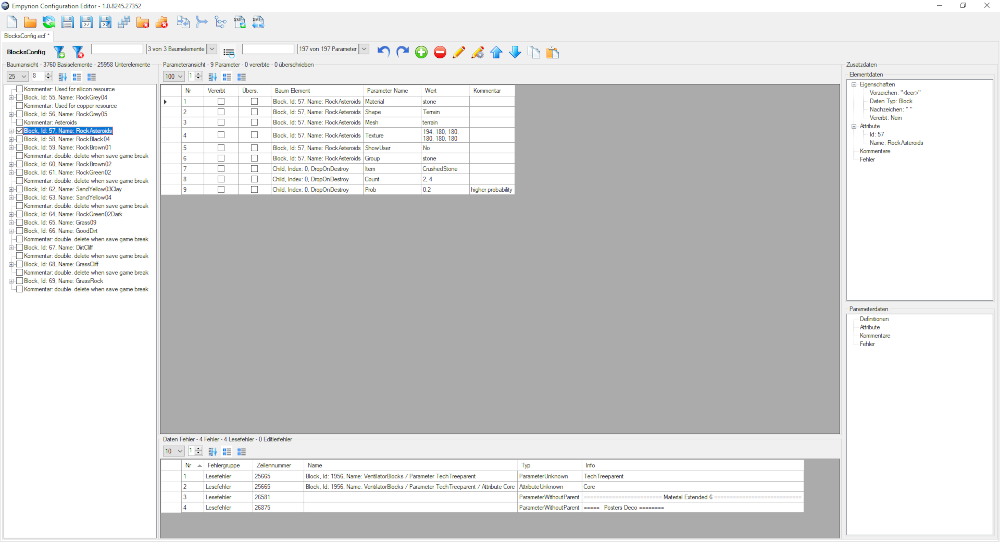

# EgsEcfEditorApp
An application to simplify the handling and customizing of the .ecf configuration files of [Empyrion Galactic Survival](https://empyriongame.com/)

## Content
- [Motivation](#motivation)
- [Installation](#installation)
- [Feature Overview](#feature-overview)
- [Operations Overview](#operations-overview)
- [Shortcuts and Icons](#shortcuts-and-icons)
- [File Content Definition](#file-content-definition)
- [File Content Recognition](#file-content-recognition)
- [Planned Major Features](#planned-major-features)

## Motivation

## Installation

## Feature Overview

## Operations Overview

## Shortcuts and Icons
- `double-click` opens the edit panel for the clicked item
- `right-click` opens the context panel for the clicked item
- `delete` removes the selected items
- `strg + c` copies the selected items to the clipboard
- `strg + v` pastes the copied items into the selected item, or after it if insertion is not allowed for the item

## File Content Definition

## File Content Recognition

## Planned Major Features
- Support for all .ecf files
- Compare files view
- Merge files with behaviour selection
- Element, Parameter, Comment moving
- TechTree Preview
- Element, Parameter, Attribute, Comment mass changing (base on filter/types)
- SaveAs with taking applied filter into account
- Undo / Redo

The next steps will be the compare / merge feature togehter with more supported files.
